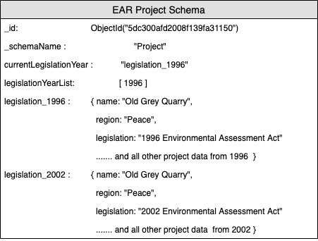
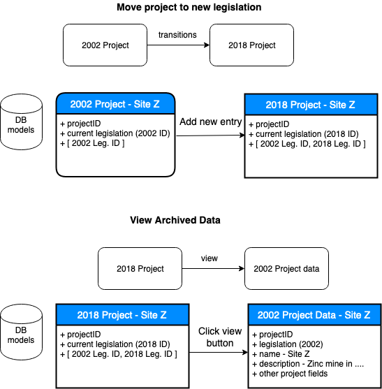

# EAR Project models update

New legislation requirements necessitate updates to our model schemas for projects. The new legislation adds new types for several fields including: author, phase, document type, and document milestones. Projects will have the option to view archived data from previous legislations, this will require storing project data per legislative year (ie. 1996, 2002, 2018)
New projects and documents will have a radio toggle for which legislation applies.

The following diagram is an example of the new database model for projects.

A project will now contain it's ID, a field for the active legislation for the project, and an array of the legislative years (numbers) and keys per legislation that applies to the project. The legislation keys (ie "legislation_1996") will contain project data objects, which will contain all the information related to a project. 

Projects will only be able to transition forward to a new legislation, previous project data under other legislations will be read only for archive purposes.

