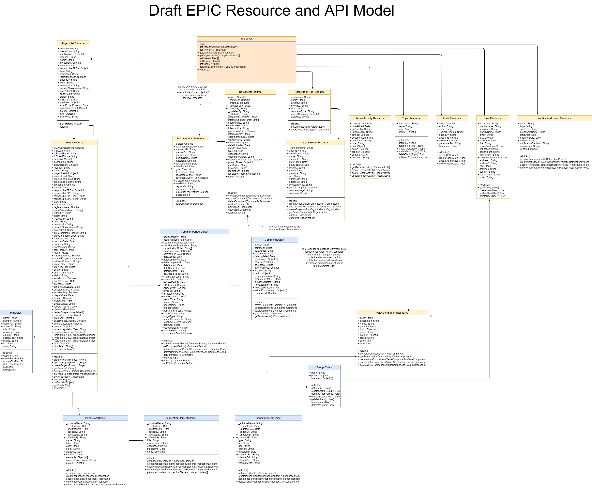

# EPIC Resource and API Model

Resource model describing the direction to move eagle-api towards. Resource and Objects are following the existing model, with the additions of potential List resource examples.
The API itself would ideally move towards a mature restful model following the structure described in the epic resource model.
While HATEOAS (top level, relLinks, see https://en.wikipedia.org/wiki/HATEOAS) is desirable to assist with any future consumers of the API, it can be optional for the time being

