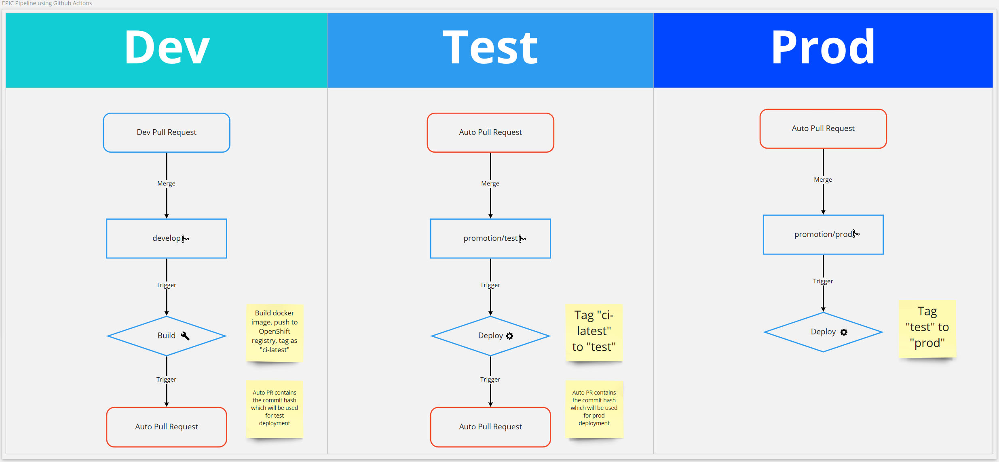

# Pipeline

The EPIC project has moved away from PR based pipeline due to the complexity and reliability concerns of the PR based pipeline imlementation. The current CI/CD pipeline utilises Github Actions to build Docker images and push them back into the BC Gov OpenShift Docker registry.

**TEST** and **PROD** environment promotions are also handled by Github Actions when automatically created promotion Pull Requests are merged into `promotion/test` and `promotion/prod` branches.

## Requirements

- OpenShift Service Account with `read` and `update` permission on OpenShift `imagestreams`, `imagestreamtags` and `imagetags`
- Rocket.Chat webhook URL for deployment notifications

### Github Secrets

| Secret                        | Description                                                                                                                                    |
| ----------------------------- | ---------------------------------------------------------------------------------------------------------------------------------------------- |
| OPENSHIFT_REPOSITORY          | OpenShift Docker repository URL                                                                                                                |
| OPENSHIFT_REPOSITORY_USERNAME | OpenShift Docker repository login name, default is `serviceaccount`                                                                            |
| OPENSHIFT_REPOSITORY_PASSWORD | OpenShift Docker repository password, can be found on the service account `dockercfg` secret                                                   |
| OPENSHIFT_TOKEN               | OpenShift login token, can be found on the service account `token` secret                                                                      |
| OPENSHIFT_URL                 | OpenShift platform URL, same as the one in the `oc login` command                                                                              |
| PERSONAL_ACCESS_TOKEN         | Github Personal Access Token for `epicbcdk` account with `repo` permissions. This is needed to allow Github Actions to trigger other workflows |
| ROCKET_CHAT_URL               | Rocket.Chat webhook URL for deployment notifications                                                                                           |

## GitHub Branches

EPIC's active default branch is the **develop** branch, developers should branch from and make pull requests to it. **main** branch contains the code that is active in production.

- **develop** - default branch, all pull requests branch from it
- **test** - CI branch, keep record of code deployed in TEST
- **main** - CI branch, keep record of code deployed in PROD

## Pipeline Flow

A fix or feature may require pull requests to a subset of eagle api, public, and admin repositories.

Test and Prod environment promotions are done using the automatically created pull requests against the `promotion/test` and `promotion/prod` branches. The `promotion/test` and `promotion/prod` branches are simplied used to track currently deployed commit hashes in the TEST and PROD environments. They are also used to trigger the deployment Github Action workflows.

1. Create a pull request to one of the eagle repositories
2. SonarCloud scan and Github Action unit tests and linting run
3. Trigger builds upon dev pull request merge
4. `:ci-latest` image is built and pushed into OpenShift repository
5. **TEST** promotion pull request is automcatically created against `promotion/test` branch
6. Trigger **TEST** deployment when `promotion/test` pull request is merged
7. **PROD** promotion pull request is automcatically created against `promotion/prod` branch
8. Trigger **PROD** deployment when `promotion/prod` pull request is merged

## TODO

- Re-implement the **hotfix** branch pipeline
- Re-implement the PR based pipeline with better reliability 
