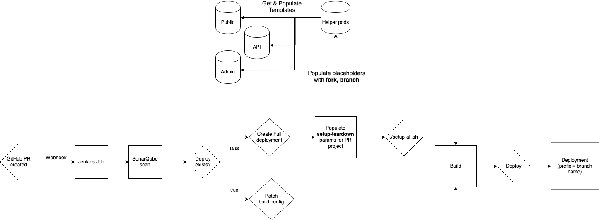

# PR Based Pipeline

Eagle projects are built using a Pull Request based pipeline and CI/CD flow using Jenkins.
Eagle is structured as a microservice repository, with three application repositories. Pull requests are built
and deployed together based on the branch name of the open pull request. 

A deployment status badge will be shown on the pull request with a link to the deployment once it is active.

## Requirements

- Linking builds and deployments across repositories requires consistent branch naming for pull requests to different
Eagle projects (ie. PR to api and admin repositories).

- Due to resource constraints in the build and deploy environemnts it is recommended that small changes be grouped together 
in a pull request instead of several smaller pull requests.


## Pull Request Template

The pipeline makes use of setup and teardown scripts from the [eagle-helper-pods](https://github.com/bcgov/eagle-helper-pods) repository.

The **project set** for pull requests are in [CUSTOM_SETTINGS/PR](https://github.com/bcgov/eagle-helper-pods/tree/master/openshift/setup-teardown/params/CUSTOM_SETTINGS/PR)
of the setup-teardown parameters. There are three placeholder parameters that are replaced during the builds; fork-placeholder, pr-placeholder, and branch-placeholder.

- **fork-placeholder** - replaced by the source fork of the pull request
- **branch-placeholder** - replaced by branch name from source fork, case-sensitive as it is used as part of a Github URL to retrieve templates
- **pr-placeholder** - replaced by lower case branch name, used as a prefix for all openshift resources (ie. *pr-123-eagle-public-build*) and an app label (ie. *pr-123-epic*)

## Pipeline flow

A fix or feature may require pull requests to a subset of eagle api, public, and admin repositories. Provided they all use the same branch name they will all be deployed together. The first pull request will create a full deployment of Epic including all deployments, builds, and other necessary resources as defined in the templates. The second pull request in skips the full deployment and instead updates that app's build config to point at the fork and branch of that pull request.

1. Create a pull request to one of the eagle repositories
2. Webhook triggers Jenkins job for that repository
3. Sonarqube Scan
4. Check if a deployment for this Pull Request already exists

   Yes - populate PR template and run **setup-all.sh**  
   No - update app's build conifg 

5. Trigger builds and wait for this apps build completion
6. Wait for deployment to roll out
7. Generate fake data
8. PAUSE (non-blocking) and wait to Cleanup deployment



## Clean-up

There are two ways to clean up a pull request's deployment.

1. Final Stage - Jenkins Input Step (Clean-up or Ignore)
2. Manual cleanup using [pr-cleanup-helper.sh](https://github.com/bcgov/eagle-helper-pods/blob/master/openshift/setup-teardown/pr-cleanup-helper.sh)

Each Jenkins job will wait at a final **input** step for confirmation to clean up the dpeloyment. However if a build is aborted, has an exception, or the PR is closed, this step won't be triggered. In this case you can either re-run the job, which will skip full deployment (already exists) and skip to the build step.

Alternately the [teardown-all.sh](https://github.com/bcgov/eagle-helper-pods/blob/master/openshift/setup-teardown/teardown-all.sh) and *pr-cleanup-helper* scripts can be used to remove a deployment in the event of a bad deploy, aborted job, or closed PR. Assuming an existing *eagle-helper-pods* checkout exists locally:

### Manual steps

> NOTE: git diff step is to verify the templates were updated, in *projectset.config* the target project **MUST** be **PR**

```
git checkout master
cd openshift/setup-teardown
./pr-cleanup-helpre.sh branch-name-lowercase
git diff

!!!! VERIFY PROJECTSET = PR !!!! (projectset.config)

./teardown-all.sh
```

Watch script to verify it is removing objects prefixed with *branch-name-lowercase*, abort if not. If the scripts don't find a matching object nothing will be removed and the script will continue.


## Troubleshooting

### Jobs are stuck waiting

Currently an Openshift wrapper method is used to allow stages to restart if they've failed using an input step. However sometimes this or an exception can cause this input step to block the Jenkins executor. If this happens you'll need to find the blocking job and select an input option (restart or ignore) or abort the job.

### The build or deployment failed

In Openshift:

1. In the TOOLS namespace - Check the build configs have all started or have failed.
   
   Check the build logs for errors

2. In the DEV namespace - Check the deployments, are there enough resources to complete the deployment?

   If quota has been reached, other PR's will have to be closed and cleaned up to make room.

### PR Merged before cleanup

Use the pr-cleanup-helper script to remove the deployment


## TODO

- Update or replace the Sonar step with a GitHub Action or SonarCloud. The report retrieval from the Sonar server has been prone to timeout errors. Could look into replacing the report retrieval with a webhook from Sonar to Github.
- Fix the input issue that causes the Jenkins executor to become blocked.
