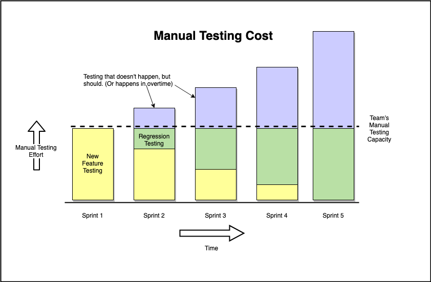
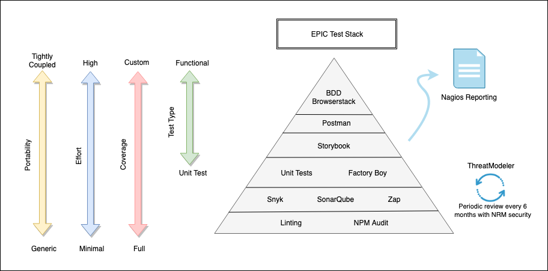
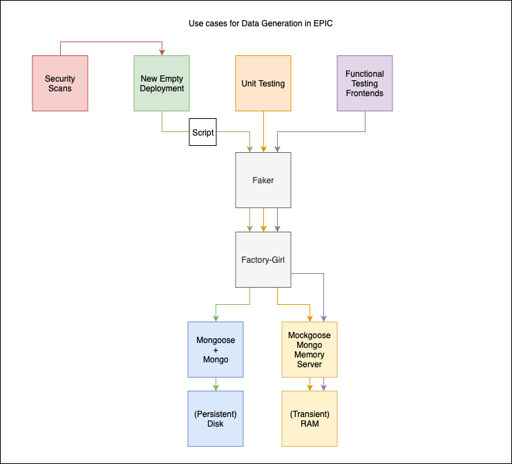

# EPIC Test Stack

Testing is expensive so we wish to develop automated tests as part of our continuous integration pipeline. Automated testing is reliable in that tests are automatically run by tools and scripts. It is also significantly faster than manual testing, and can be run frequently. Manual testing does not scale well, especially considering sprints that have a fixed amount of time and cannot afford to dedicate time for manual testing every time.

## EPIC Testing Components

The levels of the test pyramid correspond to the amount of  portability, effort, and coverage of the the test/tool.

Testing components used are as follows:

* **BDD Stack** for functional testing
* **Postman** for testing API
* **Storybook** to test Bit common components
* **Karma-Jasmine** to run local unit tests to test individual units of software
* **Factory Girl** for easy handling of nested objects containing fake data provided by Faker
* **Snyk** for version and security vulnerability scanning
* **SonarQube** for static code analysis
* **Zap** for security WAVA (web application vulnerability assessment) scanning
* **Linting** to ensure code readability
* **NPM Audit** for vulnerability scans related to npm modules
* **APM** for application performance monitoring in order to detect inefficient code and bugs that users do not report
* **ThreatModeler** for security threat modeling to be run periodically with NRM security
* **Nagios Reporting** to consolidate the results of all tests into one report

## Data Generation Use Cases

