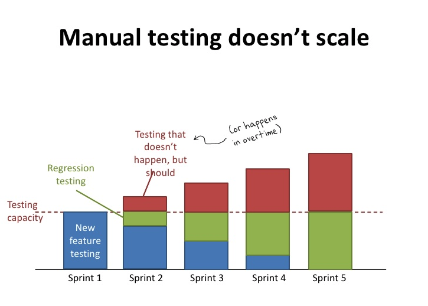

# EPIC Test Stack

Testing is expensive so we wish to develop automated tests as part of our continuous integration pipeline. Automated testing is reliable in that tests are automatically run by tools and scripts. It is also significantly faster than manual testing, and can be run frequently. Manual testing does not scale well, especially considering sprints that have a fixed amount of time and cannot afford to dedicate time for manual testing every time.

## EPIC Testing Components
Testing components that the team discussed we will use are as follows:

* **BDD Stack** for functional testing
* **Postman** for testing API
* **Storybook** to test Bit common components
* **Snyk** for version and security vulnerability scanning
* **SonarQube** for static code analysis
* **Zap** for security scanning by penetration testing
* **Linting** to ensure code readability
* **NPM Audit** for vulnerability scans related to npm modules
* **Unit Tests** to test individual units of software
* **Factory Boy** for test data generation

## EPIC Testing Pyramid

Diagram of the EPIC Testing Pyramid from functional to unit testing.

